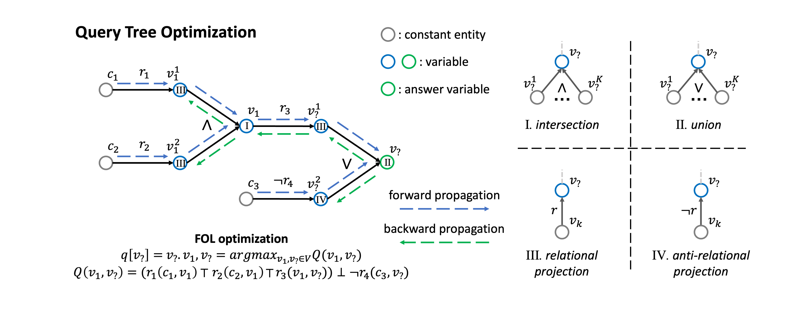

## Answering Complex Logical Queries on Knowledge Graphs via Query Computation Tree Optimization
[](https://paperswithcode.com/sota/complex-query-answering-on-fb15k?p=answering-complex-logical-queries-on)
[](https://paperswithcode.com/sota/complex-query-answering-on-fb15k-237?p=answering-complex-logical-queries-on)
[](https://paperswithcode.com/sota/complex-query-answering-on-nell-995?p=answering-complex-logical-queries-on)

This is the official codebase of the State-of-the-Art **QTO** framework for complex query answering, proposed in [Answering Complex Logical Queries on Knowledge Graphs via Query Computation Tree Optimization](https://arxiv.org/abs/2212.09567).

## Overview
We present **QTO**, an optimization-based method for answering complex logical queries on knowledge graphs. QTO efficiently finds the theoretically optimal solution by a forward-backward propagation on the tree-like computation graph. Here is an overview of our method:



This is the PyTorch implementation of our proposed model based on the [KGReasoning](https://github.com/snap-stanford/KGReasoning) code framework.

## Data Preparation
Download KG data (FB15k, FB15k-237, NELL995) from [here](http://snap.stanford.edu/betae/KG_data.zip), and place them under folder `data/`.
Go to `kbc/` folder to prepare KG data for KGE model training:
```
mkdir data/
python preprocess_datasets.py
```

## Pretrain KGE
QTO requires a pretrained knowledge graph embedding (KGE) model for complex query answering. We utilize the KGE implementation from [ssl-relation-prediction](https://github.com/facebookresearch/ssl-relation-prediction).
To train KGE (ComplEx) models on the three datasets, run the following commands under the `kbc/` folder.

**FB15K**
```
CUDA_VISIBLE_DEVICES=0 python main.py --dataset FB15K --score_rel True --model ComplEx --rank 1000 --learning_rate 0.1 --batch_size 100 --lmbda 0.01 --w_rel 0.1 --max_epochs 100
```
**FB15k-237**
```
CUDA_VISIBLE_DEVICES=0 python main.py --dataset FB15K-237 --score_rel True --model ComplEx --rank 1000 --learning_rate 0.1 --batch_size 1000 --lmbda 0.05 --w_rel 4 --max_epochs 100
```
**NELL995**
```
CUDA_VISIBLE_DEVICES=0 python main.py --dataset NELL995 --score_rel True --model ComplEx --rank 1000 --learning_rate 0.1 --batch_size 1000 --lmbda 0.05 --w_rel 0 --max_epochs 100
```

## Query Answering with QTO
We provide commands to reproduce the results in our paper. Note that `--kbc_path` should be followed by the actual path to your pretained KGE model in the last step. `--fraction` is used to scatter the neural adjacency matrix to $n$ parts so that each part can be stored as a dense matrix on the GPU during calculation. Increase the fraction size in case of GPU out-of-memory.
The command will first calculate the neural adjacency matrix using pretrained KGE model (saved under `kbc/{dataset}/`), and save it under folder `neural_adj/`.

**FB15K**
```
CUDA_VISIBLE_DEVICES=0 python main.py --data_path data/FB15k-betae --kbc_path kbc/FB15K/best_valid.model --fraction 10 --thrshd 0.001 --neg_scale 6 
```
**FB15k-237**
```
CUDA_VISIBLE_DEVICES=0 python main.py --data_path data/FB15k-237-betae --kbc_path kbc/FB15K-237/best_valid.model --fraction 10 --thrshd 0.0002 --neg_scale 3
```
**NELL995**
```
CUDA_VISIBLE_DEVICES=0 python main.py --data_path data/NELL-betae --kbc_path kbc/NELL995/best_valid.model --fraction 10 --thrshd 0.0002 --neg_scale 6
```
The evaluation results will be saved under the `results/` folder. Add `--do_cp` command to further do cardinality prediction. Add `--path` command for interpretability evaluation, and the intermediate variable interpretations will also be printed on the screen for observation. '*y*' indicates the edge is trivially in the training graph, '*p*' indicates the edge is only in the valid/test graph and is correctly predicted, '*n*' indicates the edge is not in the graph and is incorrectly predicted.

## Citation

Please cite our paper if you use our method in your work (Bibtex below).

```bibtex
@article{bai2022qto,
  title={Answering Complex Logical Queries on Knowledge Graphs via Query Computation Tree Optimization},
  author={Bai, Yushi and Lv, Xin and Li, Juanzi and Hou, Lei},
  journal={arXiv preprint arXiv:2212.09567},
  year={2022}
}
```
